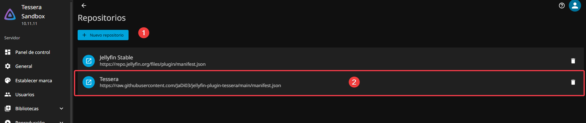
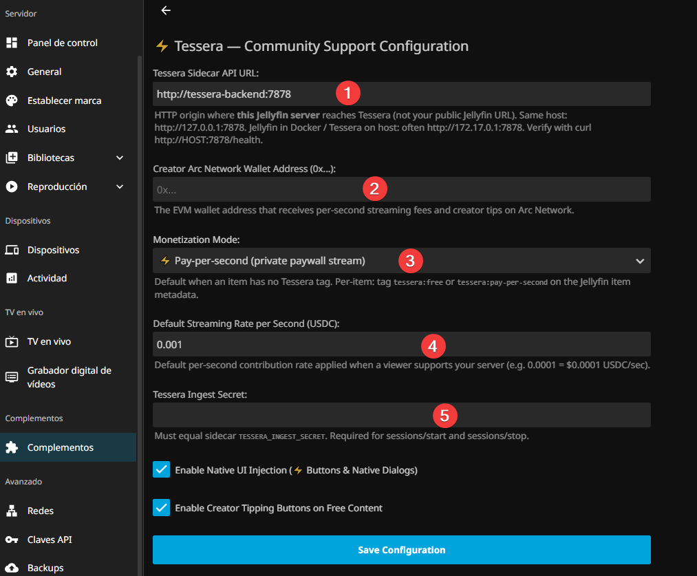
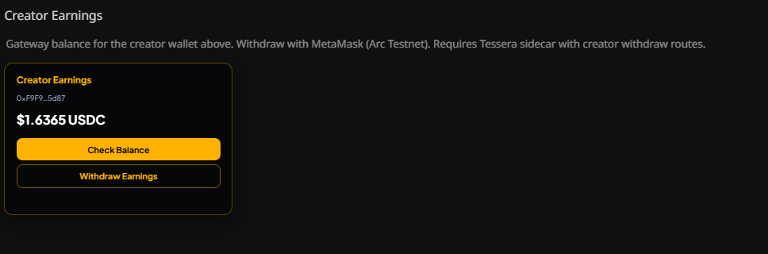

# Tessera for Jellyfin

<div align="center">

[](https://github.com/JaDi03/jellyfin-plugin-tessera)
[](https://jellyfin.org)
[](https://github.com/JaDi03/tessera)

</div>

<p align="center">
  <b><i>Jellyfin plugin for creator support: tips on free items, pay-per-second on exclusive items.</i></b>
</p>

> **TL;DR:** Install this plugin, point it at a running [Tessera](https://github.com/JaDi03/tessera) sidecar, tag your library items, and fill the Dashboard settings. Sidecar setup: [Getting Started](https://jadi03.github.io/tessera/getting-started/). Modes: [Payment models](https://jadi03.github.io/tessera/payment-models/). Spec: [Connector spec](https://jadi03.github.io/tessera/connectors/spec/).

---

## What this plugin does

- **Exclusive** (`tessera:pay-per-second`): paywall on the player; viewer unlocks, then play is billed per second.
- **Free** (`tessera:free`): no lock; viewer can tip manually.
- **Creator Earnings** on the plugin page: check balance and withdraw (via Tessera).

Circle keys and `MASTER_KEY` stay in the Tessera sidecar `.env`, not in this plugin.

---

## Tag your videos (required)

Per item, set a Jellyfin **tag** in metadata so Tessera knows the mode:

| Tag | Behavior |
| --- | --- |
| `tessera:free` | Free to watch; tips welcome |
| `tessera:pay-per-second` | Exclusive; pay-per-second overlay |

If an item has **no** Tessera tag, the plugin uses the Dashboard default (**Monetization Mode**).

Edit the item in Jellyfin → metadata / tags → add one of the tags above → save.

---

## Prerequisites

- Jellyfin **10.9+**
- A running [Tessera sidecar](https://jadi03.github.io/tessera/getting-started/) (default port `7878`)

```bash
curl -sS http://127.0.0.1:7878/health
```

Expect `"status": "healthy"`.

---

## Install and activate

1. **Dashboard → Plugins → Repositories → +**
2. Repository URL:

```text
https://raw.githubusercontent.com/JaDi03/jellyfin-plugin-tessera/main/manifest.json
```

3. **Catalog** → install **Tessera** → restart if prompted
4. **Dashboard → Plugins → Tessera** → fill settings below

<div align="center">
  
  <p><i>Figure 1: Add the Tessera repository, then install from Catalog.</i></p>
</div>

If the overlay never appears, jellyfin-web `index.html` must be writable so the plugin can inject its client script. Docker example: `docker exec -u root jellyfin chmod 666 /jellyfin/jellyfin-web/index.html`, then restart.

---

## Plugin settings

**Dashboard → Plugins → Tessera**

| Setting | What to put |
| --- | --- |
| **Tessera Sidecar API URL** | Where **this Jellyfin server** reaches Tessera (e.g. `http://127.0.0.1:7878`, or `http://172.17.0.1:7878` if Jellyfin is in Docker and Tessera is on the host) |
| **Creator Arc Network Wallet Address (0x...)** | Wallet that receives fees and tips |
| **Monetization Mode** | Default when an item has no Tessera tag |
| **Default Streaming Rate per Second (USDC)** | Rate for exclusive play |
| **Tessera Ingest Secret** | Same string as sidecar `TESSERA_INGEST_SECRET` |

Save. Keep Tessera running.

<div align="center">
  
  <p><i>Figure 2: Plugin settings.</i></p>
</div>

**Creator Earnings** appears on the same page when a valid creator wallet is saved.

<div align="center">
  
  <p><i>Figure 3: Creator Earnings.</i></p>
</div>

---

## What the viewer sees

- **Exclusive:** Tessera overlay on the player → sign in, fund Gateway, unlock → play meters. Leave / pause / end stops billing. Unused Gateway balance stays in Gateway.
- **Free:** No lock. Tip only when the viewer taps.

---

## Checklist

- [ ] `curl` sidecar `/health` is healthy
- [ ] Plugin settings saved (URL, ingest secret, wallet)
- [ ] Items tagged `tessera:free` or `tessera:pay-per-second`
- [ ] Exclusive: overlay → unlock → play meters; leave stops billing
- [ ] Free: no lock; tip only on tap

---

## License

Apache-2.0. Tessera Project.
